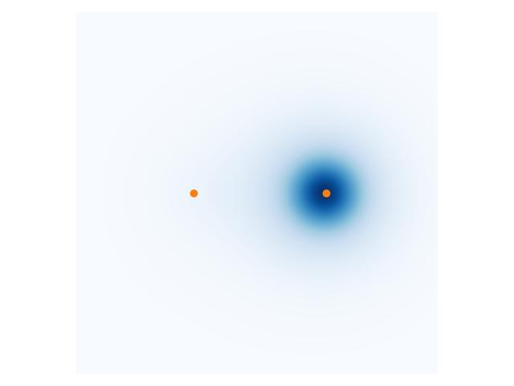

# 闭壳层 Hartree--Fock 方程: Roothaan 方程

本部分主要推导如何从 Hartree--Fock 方程出发, 得到求解限制性闭壳层体系的 Roothaan 方程, 从而对 $\mathrm{HeH}^{+}$ 系统进行求解.

Hartree--Fock 方程可以写为
```math
\hat{f}\chi_{i}(\mathbf{x})=\epsilon_{i}\chi_{i}(\mathbf{x}),\quad\hat{f}=\hat{h}+\sum_{j=1}^{N}(\hat{\mathscr{J}}_{j}-\hat{\mathscr{K}}_{j}).
```
其中 $\chi$ 表示自旋轨道, $\hat{f}$ 为 Fock 算符, 它由芯哈密顿算符 $\hat{h}$, 库仑算符 $\hat{J}$, 以及交换算符 $\hat{K}$ 给出. 它们各自的定义为
```math
\begin{align}
\hat{h}\chi_{i}(\mathbf{x}) & =-\frac{1}{2}\nabla_{i}^{2}\chi_{i}(\mathbf{x}_{})+\sum_{k}\frac{Z_{k}}{|\mathbf{r}_{i}-\mathbf{r}_{k}|}\chi_{i}(\mathbf{x}),\\
\hat{\mathscr{J}_{j}}\chi_{i}(\mathbf{x}) & =\int\mathrm{d}\mathbf{x}'\chi_{j}^{*}(\mathbf{x}')\chi_{j}(\mathbf{x}')\frac{1}{|\mathbf{r}_{i}-\mathbf{r}_{j}|}\chi_{i}(\mathbf{x}),\\
\hat{\mathscr{K}_{j}}\chi_{i}(\mathbf{x}) & =\int\mathrm{d}\mathbf{x}'\chi_{j}^{*}(\mathbf{x}')\chi_{i}(\mathbf{x}')\frac{1}{|\mathbf{r}_{i}-\mathbf{r}_{j}|}\chi_{j}(\mathbf{x}).
\end{align}
```


为了使求解过程简化,我们假设每个空间轨道 $\psi_{i}(\mathbf{r})$ 都被自旋向上和向下的两个电子占据. 为了得到关于空间轨道的方程, 我们需要把自旋部分积分掉. 设 $\chi_{i}(\mathbf{x}\_{i})=\psi_{i}(\mathbf{r}_{i})\alpha(\omega)$, 则
```math
\begin{align}
\hat{f}\psi_{i}(\mathbf{r}) & =\hat{h}\psi_{i}(\mathbf{r})+\sum_{j=1}^{N}\int\mathrm{d}\mathbf{x}'\chi_{j}^{*}(\mathbf{x}')\chi_{j}(\mathbf{x}')\frac{1}{|\mathbf{r}_{i}-\mathbf{r}_{j}|}\psi_{i}(\mathbf{r})\nonumber \\
 & \qquad-\int\mathrm{d}\omega\alpha^{*}(\omega)\sum_{j=1}^{N}\int\mathrm{d}\mathbf{x}'\chi_{j}^{*}(\mathbf{x}')\psi_{i}(\mathbf{r}')\alpha(\omega')\frac{1}{|\mathbf{r}_{i}-\mathbf{r}_{j}|}\chi_{j}(\mathbf{x}),\\
 & =\hat{h}\psi_{i}(\mathbf{r})+2\sum_{c=1}^{N/2}\int\mathrm{d}\mathbf{r}'\psi_{c}^{*}(\mathbf{r}')\psi_{c}(\mathbf{r}')\frac{1}{|\mathbf{r}_{i}-\mathbf{r}_{j}|}\psi_{i}(\mathbf{r})\nonumber \\
 & \qquad-\sum_{c=1}^{N/2}\int\mathrm{d}\mathbf{r}'\psi_{c}^{*}(\mathbf{r}')\psi_{i}(\mathbf{r}')\frac{1}{|\mathbf{r}_{i}-\mathbf{r}_{j}|}\psi_{c}(\mathbf{r}).
\end{align}
```
于是
```math
\begin{align}
\hat{f} & =\hat{h}+\sum_{c=1}^{N/2}(2\hat{J}_{c}-\hat{K}_{c}),\\
\hat{J_{c}}\psi_{i}(\mathbf{r}) & =\int\mathrm{d}\mathbf{r}'\psi_{c}^{*}(\mathbf{r}')\psi_{c}(\mathbf{r}')\frac{1}{|\mathbf{r}_{i}-\mathbf{r}_{j}|}\psi_{i}(\mathbf{r}),\\
\hat{K_{c}}\psi_{i}(\mathbf{r}) & =\int\mathrm{d}\mathbf{r}'\psi_{c}^{*}(\mathbf{r}')\psi_{i}(\mathbf{r}')\frac{1}{|\mathbf{r}_{i}-\mathbf{r}_{j}|}\psi_{c}(\mathbf{r}).
\end{align}
```


引入 $K$ 个基函数 $\phi_{\nu}$, 则轨道波函数可以表示为
```math
\psi_{i}=\sum_{\nu=1}^{K}C_{\nu i}\phi_{\nu}.
```
代入第 (1) 式, 然后两边乘以 $\phi_{\mu}^{*}$ 并积分得到
```math
\sum_{\mu=1}^{K}C_{\mu i}\int\mathrm{d}\mathbf{r}\phi_{\mu}^{*}(\mathbf{r})\hat{f}\phi_{\nu}(\mathbf{r})=\epsilon_{i}\sum_{\mu=1}^{K}C_{\mu i}\int\mathrm{d}\mathbf{r}\phi_{\mu}^{*}(\mathbf{r})\phi_{\nu}(\mathbf{r}).
```
为了把方程写得更加紧凑, 我们定义重叠矩阵 $\mathbf{S}$, Fock 矩阵 $\mathbf{F}$, 系数矩阵 $\mathbf{C}$, 能量矩阵 $\boldsymbol{\varepsilon}$
```math
\begin{align}
S_{\mu\nu} & =\int\mathrm{d}\mathbf{r}\phi_{\mu}^{*}(\mathbf{r})\phi_{\nu}(\mathbf{r}),\\
F_{\mu\nu} & =\int\mathrm{d}\mathbf{r}\phi_{\mu}^{*}(\mathbf{r})\hat{f}\phi_{\nu}(\mathbf{r}),\\
\varepsilon_{ij} & =\epsilon_{i}\delta_{ij}.
\end{align}
```
从而得到 Roothan 方程
```math
\mathbf{FC}=\mathbf{SC}\boldsymbol{\varepsilon}.
```


其中, Fock 矩阵 $\mathbf{F}$ 是由系数矩阵 $\mathbf{C}$ 得到的, 所以这是一个需要自洽迭代求解的方程. 为了将它们的关系更明确地写出来, 我们需要引入密度矩阵
```math
P_{\mu\nu}=2\sum_{c}^{N/2}C_{\mu c}C_{\nu c}^{*}.
```
它与密度的关系为
```math
\rho(\mathbf{r})=\sum_{\mu\nu}P_{\mu\nu}\phi_{\mu}(\mathbf{r})\phi_{\nu}(\mathbf{r}).
```
于是 Fock 矩阵就可以写为
```math
F_{\mu\nu}=H_{\mu\nu}^{\text{core}}+\sum_{\lambda\sigma}P_{\lambda\sigma}\left[(\mu\nu|\sigma\lambda)-\frac{1}{2}(\mu\lambda|\sigma\nu)\right].
```
其中 $H_{\mu\nu}^{\text{core}}$ 为芯哈密顿量矩阵
```math
H_{\mu\nu}^{\text{core}}=\int\mathrm{d}\mathbf{r}\phi_{\mu}^{*}(\mathbf{r})\hat{h}\phi_{\nu}(\mathbf{r}).
```
而 $(\mu\nu|\sigma\lambda)$ 是双电子积分
```math
(\mu\nu|\sigma\lambda)=\int\mathrm{d}\mathbf{r}\int\mathrm{d}\mathbf{r}'\phi_{\mu}^{*}(\mathbf{r})\phi_{\nu}(\mathbf{r})\frac{1}{|\mathbf{r}-\mathbf{r}'|}\phi_{\sigma}^{*}(\mathbf{r}')\phi_{\lambda}(\mathbf{r}').
```


如果使用的是高斯型基组, 那么双电子积分、芯哈密顿量积分、重叠积分都可以利用相应的公式快速得到. 我们也可以基于 Fock 矩阵得到系统的电子的总能量
```math
E_{0}=\frac{1}{2}\sum_{\mu}\sum_{\nu}P_{\mu\nu}(H_{\mu\nu}^{\text{core}}+F_{\mu\nu}).
```


# 闭壳层 Hartree--Fock 求解算法

为了更方便地求解 Roothaan 方程, 我们可以把它进一步简化为一个本征值问题
```math
\mathbf{F}'\mathbf{C}'=\mathbf{C}'\boldsymbol{\varepsilon}.
```
其中 $\mathbf{C}'=\mathbf{X}^{-1}\mathbf{C}$, $\mathbf{F}'=\mathbf{X}^{\dagger}\mathbf{F}\mathbf{X}$. 而 **$\mathbf{X}$** 是一个变换矩阵, 它把重叠矩阵正交化为一个单位矩阵 $\mathbf{X}^{\dagger}\mathbf{S}\mathbf{X}=\mathbf{1}$. 由于 $\mathbf{S}$ 是厄米的, 我们总可以对角化得到一个酉矩阵 $\mathbf{U}$ 使得 $\mathbf{U}\mathbf{S}\mathbf{U}^{\dagger}=\mathbf{s}$ 对角. 那么我们可以选择变换矩阵
```math
X_{ij}=U_{ij}/s_{j}^{1/2}.
```


至此我们就可以完整地给出对于 $\mathrm{HeH}^{+}$ 系统的闭壳层 Hartree--Fock 自洽求解算法了:

1.  从基组文件中读取 $\mathrm{H}$ 和 $\mathrm{He}$ 的基组信息 (高斯函数的指数和叠加系数)

2.  计算双电子积分 $(\mu\nu|\sigma\lambda)$、芯哈密顿量矩阵 $H_{\mu\nu}^{\text{core}}$、重叠积分 $\mathbf{S}$

3.  计算变换矩阵 $\mathbf{X}$

4.  猜测密度矩阵 $P_{\mu\nu}=0$

5.  利用密度矩阵 $\mathbf{P}$ 和之前计算好的积分计算 Fock 矩阵

6.  计算变换后的 Fock 矩阵 $\mathbf{F}'=\mathbf{X}^{\dagger}\mathbf{F}\mathbf{X}$

7.  求解本征值问题, 得到 $\mathbf{C}'$ 和 $\boldsymbol{\varepsilon}$

8.  用 $\mathbf{C}=\mathbf{X}\mathbf{C}'$ 构造新芯密度矩阵 $\mathbf{P}$

9.  计算体系的电子总能 $E_{0}$

10. 判断密度矩阵和总能是否收敛. 若收敛则结束自洽流程, 否则回到第 5 步

# 程序输出结果

    ==============================
          Constant Matrices
    ==============================
    Overlap matrix S:
    [[1.         0.53681935]
     [0.53681935 1.        ]]

    Kinetic matrix T:
    [[0.76003188 0.19744319]
     [0.19744319 1.41176317]]

    Potential matrix V_{ne}:
    [[-2.49185755 -1.6292717 ]
     [-1.6292717  -4.01004618]]

    Two-electron integral V_{ee}:
    [[[[0.77460594 0.37025079]
       [0.37025079 0.61142525]]

      [[0.35123656 0.2239145 ]
       [0.2239145  0.45350297]]]


     [[[0.3928327  0.22598329]
       [0.22598329 0.43937276]]

      [[0.60909675 0.44585886]
       [0.44585886 1.05571294]]]]

    ==============================
           Start Iteration
    ==============================
    [iter  0] Electron total energy: 0.000000
    [iter  1] Electron total energy: -4.164218
    [iter  2] Electron total energy: -4.203401
    [iter  3] Electron total energy: -4.205855
    [iter  4] Electron total energy: -4.206048
    [iter  5] Electron total energy: -4.206074
    [iter  6] Electron total energy: -4.206078
    [iter  7] Electron total energy: -4.206079
    [iter  8] Electron total energy: -4.206080
    Total energy: -2.839212
    Orbital energies: [-1.62740772 -0.11414291]



$\mathrm{HeH}+$ 系统的电子密度分布图. 左边的黄点表示氢原子, 右边的黄点表示氦原子. 此图仅展示了 $z = 0$ 的截面.

